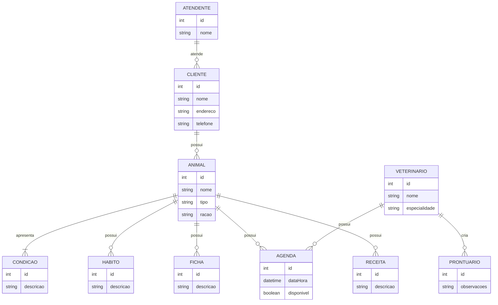
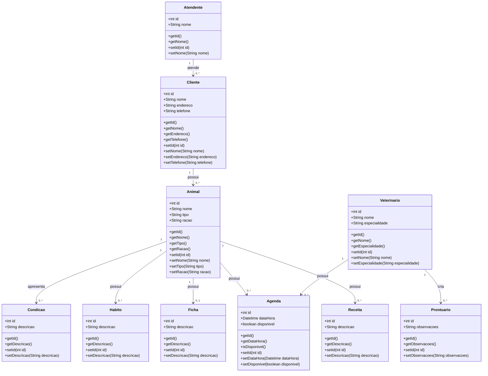
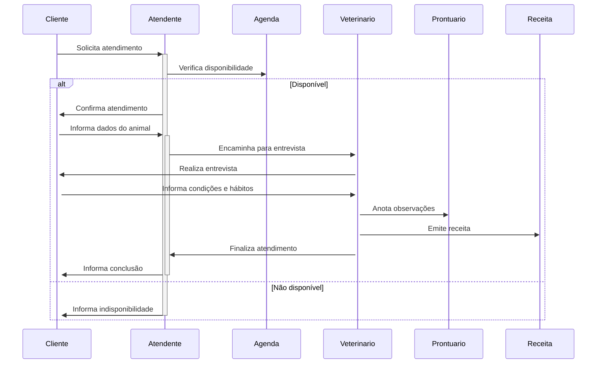
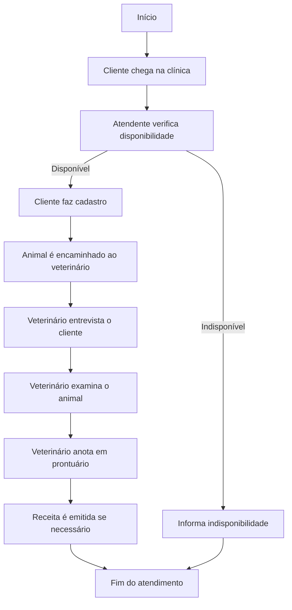
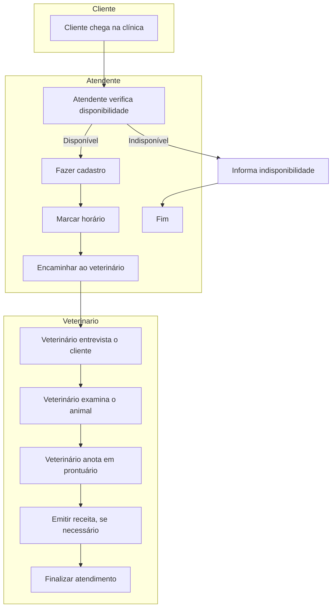
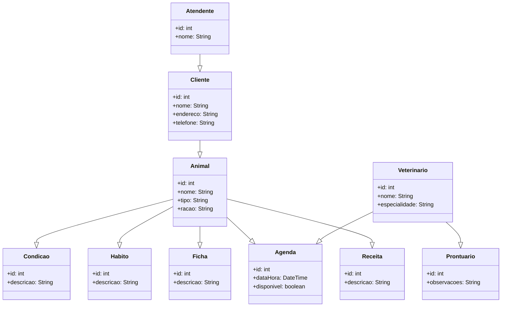

# Plano de ensino de Engenharia de Software

- [Plano de ensino de Engenharia de Software](#plano-de-ensino-de-engenharia-de-software)
  - [1. Turma: FACET-SNP-308 - ENGENHARIA DE SOFTWARE (60h) - Turma: 01 (2024.2)](#1-turma-facet-snp-308---engenharia-de-software-60h---turma-01-20242)
    - [1.1. Carga Horária Total: 60](#11-carga-horária-total-60)
    - [1.2. Horário: 19hs - 22hs](#12-horário-19hs---22hs)
    - [1.3. Ementa:](#13-ementa)
    - [1.4. Metodologia:](#14-metodologia)
    - [1.5. Procedimentos de avaliação de aprendizagem:](#15-procedimentos-de-avaliação-de-aprendizagem)
    - [1.6. Horário de atendimento:](#16-horário-de-atendimento)
  - [2. Sites utilizados:](#2-sites-utilizados)
  - [3. Repositórios de apoio:](#3-repositórios-de-apoio)
  - [4. Datas de aulas e conteúdo:](#4-datas-de-aulas-e-conteúdo)
    - [4.1. Exercício](#41-exercício)
    - [4.2. Exercício 2](#42-exercício-2)
    - [4.3. Diagrama entidade relacionamento](#43-diagrama-entidade-relacionamento)
    - [4.4. Exemplos de documentações](#44-exemplos-de-documentações)
  - [5. Links para download de ferramentas para diagramação com UML:](#5-links-para-download-de-ferramentas-para-diagramação-com-uml)
  - [6. Artigos:](#6-artigos)
  - [7. Unidade de avaliação:](#7-unidade-de-avaliação)
  - [8. Referências:](#8-referências)
  - [9. Demais Disciplinas:](#9-demais-disciplinas)
  - [10. Lista de ferramentas:](#10-lista-de-ferramentas)
  - [11. Curiosidade... onde adquirir livros baratos?](#11-curiosidade-onde-adquirir-livros-baratos)
  - [12. Cursos gratuítos:](#12-cursos-gratuítos)
  - [13. Como estudar](#13-como-estudar)
  - [14. Resolução de exercícios:](#14-resolução-de-exercícios)
    - [14.1. Descrição do exercício:](#141-descrição-do-exercício)
    - [14.2. Diagrama ER](#142-diagrama-er)
    - [14.3. Class diagram](#143-class-diagram)
    - [14.4.  Sequence diagram](#144--sequence-diagram)
    - [14.5.  Flow Chart](#145--flow-chart)
    - [14.6.  Use Case Diagram](#146--use-case-diagram)
    - [14.7.  Deployment diagram](#147--deployment-diagram)

---
## 1. Turma: FACET-SNP-308 - ENGENHARIA DE SOFTWARE (60h) - Turma: 01 (2024.2)

### 1.1. Carga Horária Total: 60

### 1.2. Horário: 19hs - 22hs

5N231, Quinta feira, Sala C8 - Fase 4.

### 1.3. Ementa: 

Processos de software. Métodos tradicionais de análise de sistemas. Métodos ágeis de análise e desenvolvimento de software. Introdução a UML. Projeto de Software.

### 1.4. Metodologia:

Aulas expositivas, dialogadas, com apresentação de conceitos teóricos/práticos, comentários de casos de interesse correlatos, comentários sobre eventuais produtos e tecnologias relacionadas ao tema da disciplina. Aulas complementares faltantes e/ou remotas/EaD, serão atribuidas com conteúdos disponíveis na plataforma SIGAA.

Site da disciplina: https://sites.google.com/unemat.br/professoremiliano/inicio 

### 1.5. Procedimentos de avaliação de aprendizagem: 

Prova presencial escrita objetiva de múltipla escolha. Cálculo de notas por soma de pontos. Resultado final via média simples entre avaliações. Excepcionalmente poderão ocorrer avaliações online. Poderão ocorrer atividades online objetivando fixação de conceitos (valendo pontos ou não). Provas de 2ª chamada devem ser requisitas dentro do prazo e formalmente conforme regras da faculdade; a prova de 2ª chamada é discursiva, escrita (tipo canetão).

A carga horária EAD será realizada via leitura de artigos postados pelo professor (ou videos correlatos aos assuntos abordados em sala), este material poderá estar na sua avaliação  (e disponibilizado no site do professor e na página da disciplina no github).

A 1ª avaliação terá o conteúdo das aulas de 1 a 5, a 2ª avaliação terá o conteúdo das aulas 6 a 9, a 3ª avaliação terá o conteúdo das aulas 11 a 13 e os artigos selecionados. Cada uma das três avaliações vale 0 à 10,0.A média final da disciplina é feita fazendo média aritmética simples entre as notas obtidas.O aluno será considerado aprovado se atingir média igual ou superior a 7,0.Alunos com nota >= 5,0 e < 7,0 têm direito à nota de exame final.  O exame final será aplicado após a avaliação 3.

### 1.6. Horário de atendimento:

30 minutos antes da aula (via agendamento prévio).

---
## 2. Sites utilizados:

| Sites utilizados | Url |
| --- | --- |
| Site do professor | https://www.pontodeensino.com/ |
| Site das disciplinas | https://sites.google.com/unemat.br/professoremiliano |
| Sites das disciplinas no github | https://github.com/monteiro74/aulas_2024_1 |
| Sistema Acadêmico | https://sigaa.unemat.br/sigaa/verTelaLogin.do |

---
## 3. Repositórios de apoio:
| Repositório | Url |
| --- | --- |
| Diagramas resumo de engenharia de software | https://github.com/monteiro74/diagramas_resumo |
| Projeto C# com Windows Forms| https://github.com/monteiro74/prototipacao_mobile_csharp |
| Lista de ferramentas | https://github.com/monteiro74/lista_de_ferramentas |
| Projeto Webview com Android | https://github.com/monteiro74/project_webview |
| Projeto com Flutter flow | https://github.com/monteiro74/prototipacao_flutterflow1 |
| Projeto com Evolus Pencil | https://github.com/monteiro74/prototipacao_mobile_evoluspencil |

---
## 4. Datas de aulas e conteúdo: 

| Data    | Conteúdo |
| ------- | ------- |
| Aula 1: |  |
| Aula 2: |  |
| Aula 3: |  |
| Aula 4: |  |
| Aula 5: |  |
| Aula:   |  |
| Aula 6: |  |
| Aula 7: |   |
| Aula 8: |  |
| Aula 9: |   |
| Aula 10:|  |
| Aula 11:|  |
| Aula 12:|  |
| Aula 13: |  |
| Aula 14: |  |

---
### 4.1. Exercício

Exercício 1:

...mais detalhes, continua nos slides da aula 8 !!!

### 4.2. Exercício 2

---
### 4.3. Diagrama entidade relacionamento

Diagrama das tabelas do banco que vamos usar com a ferramenta IDE RAD Scriptcase nos exercícios em sala de aula:

---
### 4.4. Exemplos de documentações

Documentações geradas no Doxygen e no StarUML e disponibilizadas em repositórios no github como sites online:

Projeto 1:
Página no github: https://github.com/monteiro74/documentacao_doxygen

Site: https://monteiro74.github.io/documentacao_doxygen/

Projeto 2:
Página no github: https://github.com/monteiro74/documentacao_uml

Site: https://monteiro74.github.io/documentacao_uml/

Como criar uma página web no github: https://docs.github.com/en/pages/getting-started-with-github-pages/creating-a-github-pages-site

---
## 5. Links para download de ferramentas para diagramação com UML:

[Papyrus](https://eclipse.dev/papyrus/download.html)

[Modelio](https://www.modelio.org/index.htm)

[WhiteStar](https://sourceforge.net/projects/whitestaruml/)

[Software Ideas Modeler](https://www.softwareideas.net/en/download)

[StarUML](https://staruml.io/download/)

[Visual Paradigm Community Edition](https://www.visual-paradigm.com/download/community.jsp)

[UML Designer](https://www.umldesigner.org/download/)

---
## 6. Artigos:

1. [Definição de requisitos de software baseada numa arquitetura de modelagem de negócios](https://www.scielo.br/j/prod/a/4fyvdWfsVyDQRfhqTCRJ8vL/)
2. [A aplicação da Linguagem de Modelagem Unificada (UML) para o suporte ao projeto de sistemas computacionais dentro de um modelo de referência](https://www.scielo.br/j/gp/a/RRQQ7mKTFztQXK9Sz7BKtWQ/)
3. [O impacto da transformação ágil na cultura organizacional: das práticas e valores organizacionais a gestão da mudança](https://www.scielo.br/j/pci/a/P7Bp6tdMHkw98mHFBZf9wXN/)
4. [Aplicando técnicas de elicitação de requisitos para a concepção de um sistema de informação: um relato de experiência](https://periodicos.set.edu.br/exatas/article/view/8809)
5. [Interdisciplinaridade na Engenharia de Software](https://www.researchgate.net/publication/228849325_Interdisciplinaridade_na_Engenharia_de_Software)

---
## 7. Unidade de avaliação:

Avaliação 1: //2024  
Avaliação 2: //2024  
Avaliação 3: //2024  

---
## 8. Referências:

* PRESSMAN, Roger S.. Engenharia de Software. 6ed. São Paulo: MCGRAW HILL - ARTMED, 2011.   Este livro esta disponível na biblioteca online da Unemat em: https://integrada.minhabiblioteca.com.br/reader/books/9786558040118/epubcfi/6/2[%3Bvnd.vst.idref%3DCapa.xhtml]!/4/2[page_i]/2%4076:41 
* SOMMERVILLE, Ian. Engenharia de Software. 9° Ed. São Paulo: Pearson, 2011. 
* LARMAN, Craig. Utilizando UML e Padrões. 3ed. BOOKMAN. 2007.   Este livro esta disponível na biblioteca online da Unemat em: https://integrada.minhabiblioteca.com.br/reader/books/9788577800476 
* PAULA FILHO, Wilson de Pádua. Engenharia de Software: fundamentos, métodos e padrões. Rio de Janeiro: LTC, 2019.   Este livro esta disponível na biblioteca online da Unemat em: https://integrada.minhabiblioteca.com.br/reader/books/9788521636724/epubcfi/6/2%5B%3Bvnd.vst.idref%3Dcover%5D!/4/2/2%4050:90  
* SBROCCO, José Henrique Teixeira de Carvalho Metodologias ágeis: engenharia de software sob medida. Tradução: José Henrique Teixeira de Carvalho Sbrocco, Paulo Cesar de Macedo. -- 1. ed. -- São Paulo: Érica, 2012. https://integrada.minhabiblioteca.com.br/books/9788536519418.   Este livro esta disponível na biblioteca online da Unemat em: https://integrada.minhabiblioteca.com.br/reader/books/9788536519418/pageid/0  

## 9. Demais Disciplinas:

1. Engenharia de Software https://github.com/monteiro74/aulas_2023/blob/main/Engenharia_de_software/plano_de_aula_engsw.md
2. Gestão de projeto de software https://github.com/monteiro74/aulas_2023/blob/main/Gerencia_de_projetos/plano_de_aula_gps.md
3. Modelagem e projeto de banco de dados https://github.com/monteiro74/aulas_2023/blob/main/Modelagem_e_projeto_de_bd/plano_de_aula_pbd.md

---
## 10. Lista de ferramentas:
[Lista de ferramentas de desenvolvimento de software](https://github.com/monteiro74/lista_de_ferramentas)

---
## 11. Curiosidade... onde adquirir livros baratos? 
A Amazon tem a opção eletrônica via Kindle e as vezes tem livros usados também.

Um site interessante para livros usados é a Estante Virtual: https://www.estantevirtual.com.br/

---
## 12. Cursos gratuítos:

* [Receita para Levantar Requisitos de Software](https://www.udemy.com/course/receita-para-levantar-requisitos-de-software/)

* [Análise e Levantamento de Requisitos de Software](https://www.udemy.com/course/analise-de-requisitos-de-software/)

* [Noções básicas de DA (Disciplined Agile) - Portuguese LatAm](https://www.pmi.org/shop/brazil/p-/elearning/no%C3%A7%C3%B5es-b%C3%A1sicas-de-da-(disciplined-agile)----portuguese-latam/e00197)

---
## 13. Como estudar

https://www.instagram.com/reel/C55lFTMAL_A/?igsh=ZTR6OW1jNmRyeTZ2

---
## 14. Resolução de exercícios:

### 14.1. Descrição do exercício:
Uma clínica veterinária chamada ABC atende apenas os animais: gatos e cachorros. 
Os clientes devem fazer um cadastro de si e dos animais. 
Os clientes devem informar as condições nas quais os animais chegam. 
Os clientes devem informar o tipo de ração que o animal come. 
O cliente deve informar hábitos do animal. 
Para cada animal é possível que mais de um veterinário o atenda. 
Os animais podem chegar e serem atendidos de acordo com uma agenda do dia. 
Cada animal atendido receberá uma ficha e um prontuário. 
Outros dono podem querer marcar horários de atendimento futuro. 
O atendimento gera uma receita para o animal. 
Quando um cliente chega na clínica veterinária ele é atendido por um atendente. 
O atendente deve verificar se existe agenda disponível com um veterinário. 
O atendente deve colocar o cliente e seu animal na fila de espera, se for o caso. 
O atendente deve levar o cliente e o animal até o veterinário. 
O veterinário deve realizar uma entrevista com o dono do animal. 
O resultado da entrevista deve ir para um formulário. 
O veterinário deverá examinar o animal e anotar em prontuário(ficha) suas observações. 
Dependendo da situação do animal este receberá uma receita.
Para a descrição a faça em markdown:
1. ER Diagram
2. Class diagram
3. Sequence diagram
4. Flow Chart
5. Activity diagram
6. Deployment diagram

---
### 14.2. Diagrama ER
   

---
### 14.3. Class diagram

---
### 14.4.  Sequence diagram

---
### 14.5.  Flow Chart

---
### 14.6.  Use Case Diagram

Observação: mermaid não tem os símbolos para representar o Ator ("bonequinho"), então eles ficaram representados usando um fluxograma simples.

---
### 14.7.  Deployment diagram

Observação: mermaid não tem os símbolos para o deployment diagrama, então eles ficaram representados usando o símbolo de classe !

