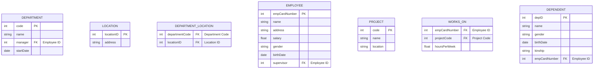
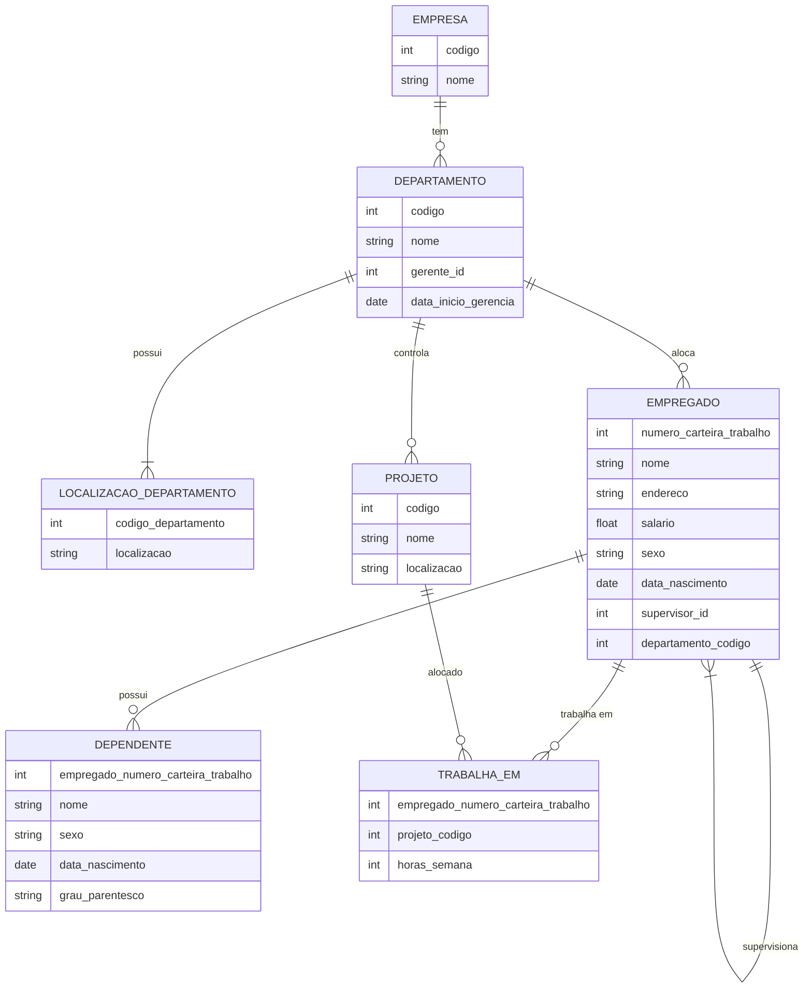

# Plano de ensino de: Modelagem e Projeto de Banco de Dados


- [Plano de ensino de: Modelagem e Projeto de Banco de Dados](#plano-de-ensino-de-modelagem-e-projeto-de-banco-de-dados)
  - [1. Turma: FACET-SNP-323 - MODELAGEM E PROJETO DE BANCO DE DADOS (60h) - Turma: 01 (2024.1)](#1-turma-facet-snp-323---modelagem-e-projeto-de-banco-de-dados-60h---turma-01-20241)
    - [1.1. Carga Horária Total: 60.](#11-carga-horária-total-60)
    - [1.2. Horário:](#12-horário)
    - [1.3. Ementa:](#13-ementa)
    - [1.4. Metodologia:](#14-metodologia)
    - [1.5. Procedimentos de avaliação de aprendizagem:](#15-procedimentos-de-avaliação-de-aprendizagem)
    - [1.6. Horário de atendimento:](#16-horário-de-atendimento)
  - [2. Sites utilizados:](#2-sites-utilizados)
  - [3. Repositórios de apoio:](#3-repositórios-de-apoio)
  - [4. Datas de aulas e conteúdo:](#4-datas-de-aulas-e-conteúdo)
    - [4.1. Diagrama entidade relacionamento](#41-diagrama-entidade-relacionamento)
    - [4.2. Exercício modelagem (mineradora) com SQL Server:](#42-exercício-modelagem-mineradora-com-sql-server)
  - [4.3. Exercício de modelagem:](#43-exercício-de-modelagem)
  - [5. Artigos:](#5-artigos)
  - [6. Unidade de avaliação:](#6-unidade-de-avaliação)
  - [7. Referências:](#7-referências)
  - [8. Demais Disciplinas:](#8-demais-disciplinas)
  - [9. Lista de ferramentas:](#9-lista-de-ferramentas)
  - [10. Curiosidade... onde adquirir livros baratos?](#10-curiosidade-onde-adquirir-livros-baratos)
  - [11. Cursos **grátis** sobre SQL Server e MySQL:](#11-cursos-grátis-sobre-sql-server-e-mysql)
  - [12. Como estudar](#12-como-estudar)


---
## 1. Turma: FACET-SNP-323 - MODELAGEM E PROJETO DE BANCO DE DADOS (60h) - Turma: 01 (2024.1)

### 1.1. Carga Horária Total: 60.

### 1.2. Horário:

Sala O8 - Fase 4, Quinta feira.

### 1.3. Ementa:

Conceitos, sistemas de gerenciamento e níveis de arquiteturas de banco de dados; Modelo Relacional: Conceitos, Restrições e Normalização; Modelos de banco de dados não-relacional.

### 1.4. Metodologia:

Aulas expositivas, dialogadas, com apresentação de conceitos teóricos/práticos, comentários de casos de interesse correlatos, comentários sobre eventuais produtos e tecnologias relacionadas ao tema da disciplina. Aulas complementares faltantes e/ou remotas/EaD, serão atribuidas com conteúdos disponíveis na plataforma SIGAA.

Site da disciplina: https://sites.google.com/unemat.br/professoremiliano/inicio 

### 1.5. Procedimentos de avaliação de aprendizagem: 

Prova presencial escrita objetiva de múltipla escolha. Cálculo de notas por soma de pontos. Resultado final via média simples entre avaliações. Excepcionalmente poderão ocorrer avaliações online. Poderão ocorrer atividades online objetivando fixação de conceitos (valendo pontos ou não). Provas de 2ª chamada devem ser requisitas dentro do prazo e formalmente conforme regras da faculdade; a prova de 2ª chamada é discursiva, escrita (tipo canetão).

A carga horária EAD será realizada via leitura de artigos postados pelo professor (ou videos correlatos aos assuntos abordados em sala), este material poderá estar na sua avaliação  (e disponibilizado no site do professor e na página da disciplina no github).

A 1ª avaliação terá o conteúdo das aulas de 1 a 5, a 2ª avaliação terá o conteúdo das aulas 6 a 9, a 3ª avaliação terá o conteúdo das aulas 11 a 13 e os artigos selecionados. Cada uma das três avaliações vale 0 à 10,0.A média final da disciplina é feita fazendo média aritmética simples entre as notas obtidas.O aluno será considerado aprovado se atingir média igual ou superior a 7,0.Alunos com nota >= 5,0 e < 7,0 têm direito à nota de exame final.  O exame final será aplicado após a avaliação 3.

### 1.6. Horário de atendimento:

30 minutos antes da aula (via agendamento prévio).

---

## 2. Sites utilizados:

| Sites utilizados | Url |
| --- | --- |
| Site do professor | https://www.pontodeensino.com/ |
| Site das disciplinas | https://sites.google.com/unemat.br/professoremiliano |
| Sites das disciplinas no github | https://github.com/monteiro74/aulas_2024_1 |
| Sistema Acadêmico | https://sigaa.unemat.br/sigaa/verTelaLogin.do |


---
## 3. Repositórios de apoio:
| Repositório | Url |
| --- | --- |
| Diagramas resumo de engenharia de software | https://github.com/monteiro74/diagramas_resumo |
| Lista de ferramentas | https://github.com/monteiro74/lista_de_ferramentas |
| Tutorial de Python | https://github.com/monteiro74/tutorial_python |
| Bibliometria | https://github.com/monteiro74/bibliometria |
| Blockchain | https://github.com/monteiro74/blockchain |
| Aprendizado de máquina | https://github.com/monteiro74/aprendizado_de_maquina |


---
## 4. Datas de aulas e conteúdo:

| Data    | Conteúdo |
| -------- | ------- |
| Aula 1:  |  |
| Aula 2:  |  |
| Aula 3:  |  |
| Aula 4:  |  |
| Aula 5:  |  |
| Aula 6:  |  |
| Aula 7:  |  |
| Aula 8:  |  |
| Aula 9:  |  |
| Aula 10: |  |
| Aula 11: |  |
| Aula 12: |  |
| Aula 13: |  |
| Aula 14: |  |
| Aula 15: |  |

Aula 12:


---
### 4.1. Diagrama entidade relacionamento

Abaixo temos um exemplo de diagrama entidade relaiconamento feito no DBeaver:


O diagrama de banco de dados feito no SQL Server é o que segue abaixo:


---
### 4.2. Exercício modelagem (mineradora) com SQL Server:


Execute o exercício abaixo no Sql Server:

1. Uma empresa possui autorização para explorar uma área na qual foi encontrado minério de interesse econômico.
2. Nesta área pode-se explorar: ouro, cassiterita, dolomito e zinco.
3. A licença para explorar a área tem uma data de início no qual foi feita a outorga e teá um data final.
3. Nesta área da empresa estão 3 jazidas.
4. Uma jazida tem apenas ouro. Nas outras duas jazidas foi detectado também cassiterita.
5. Em uma parte da área não é possível realizar nenhuma operação e é considerada área de reserva legal.
6. Uma parte da área será usada como pátio de manobra e para construção administrativa das operações de mineração.
7. Cada área contendo minerais deve informar sua produção diária (quantidade, data, tipo de mineral, etc)
8. Cada área tem coordenadas delimitadoras.
9. As atividades de lavra neste caso são: prospecção, avaliação de amostras, preparo de área, extração, filtragem e limpeza, pesagem, teste de qualidade, registro de produção e expedição final.
10. Cada atividade de operação de extração deve ter uma registro com data hora, responsável e área, bem como o que foi extraído deve ter seu lote identificado. Cada atividade de mineração tem um código, responsável, data de início e fim, hora de início e fim.
11. Os testes de qualidade de cada lote extraída da área de produção devem ser registrados com pelo menos as informações: código da área, responsável, data, volume e peso.
12. No registro de produção deve ser anotado o valor do minério na data atual.
13. Cada tipo de elemento (mineral) que se deseja explorar tem um tipo de equipamento específico para extração e transporte.
14. A expedição final deve colocar o material (ouro ou outro) em um cofre até sua saída da empresa, e o registro do responsável.
15. É necessário monitorar toda a fauna da região com pelo menos um cadastros dos animais presentes.
16. É necessário um levantamento de todas as árvores dentro e ao redor da propriedade da mineradora.
17. É necessário guardar no sistema mapas indicando as áreas de extração, preservação, pátios e administrativos ou outros mapas, de interesse da mineradora como (altimétrico, geomorfológico, hídrico, topográfico, etc).
18. O sistema deverá possuir um cadastro dos funcionários e de veículos (e maquinário), neste cadastro deve-se informar quem são os engenheiros responsáveis.
19. O sistema deverá suportar o armazenamento de arquivos PDF (como laudos, relatórios, alvará de pesquisa mineral, concessão de lavra e portaria de lavra, etc).
20. A mineradora tem uma estação meteorológica automática com pluviômetro, os dados são coletados para posterior análise.
21. Deseja se relacionar os dados climáticos com a produção de cada área.
22. A empresa também mantém um registro da produção de areia de cascalho, os quais são sub produtos da mineração.
  
A partir da descrição acima:

1. Gerar as tabelas dentro de um banco de dados no SQL Server, o nome do banco de dados será seu nome, exemplo bd_nome.
2. Fazer um backup do banco, exportar o banco.
3. Gerar o diagrama do banco de dados no SQL Server e exportar como imagem, o nome do arquivo de imagem deverá ter seu nome, exemplo diagrama_nome.jpg.
4. Enviar no Sigaa o arquivo do backup do banco e a imagem até o final da aula.

---
## 4.3. Exercício de modelagem:

Descrição do exercício:

1. A empresa é organizada em departamentos. 
2. Cada departamento possui um nome único, um código único e um determinado empregado que gerencia o departamento.
3. Acompanhamos a data inicial quando o empregado começou a gerenciar o departamento. 
4. Um departamento pode possuir diversas localizações.
5. Um departamento controla um número de projetos, cada um deles possuindo um nome único, um código único e uma única localização.
6. Armazenamos o nome, número da carteira de trabalho, endereço, salário, sexo e data de nascimento de cada empregado. 
7. Um empregado é alocado a um departamento, mas pode trabalhar em diversos projetos, que não são necessariamente controlados pelo mesmo departamento. 
8. Acompanhamos o número de horas por semana que um empregado trabalha em cada projeto. 
9. Também acompanharemos o supervisor direto de cada empregado.
10. Desejamos acompanhar e registrar os dependentes de cada empregado para fins de seguridade social. 
11. Mantemos o nome, sexo, data de nascimento e grau de parentesco com o empregado e seus dependentes.


O desenho do diagrama acima, apenas as entidades:



Abaixo o código completo com os relacionamentos no final:

```python
erDiagram
    EMPRESA {
        int codigo
        string nome
    }

    DEPARTAMENTO {
        int codigo
        string nome
        int gerente_id
        date data_inicio_gerencia
    }

    LOCALIZACAO_DEPARTAMENTO {
        int codigo_departamento
        string localizacao
    }

    PROJETO {
        int codigo
        string nome
        string localizacao
    }

    EMPREGADO {
        int numero_carteira_trabalho
        string nome
        string endereco
        float salario
        string sexo
        date data_nascimento
        int supervisor_id
        int departamento_codigo
    }

    DEPENDENTE {
        int empregado_numero_carteira_trabalho
        string nome
        string sexo
        date data_nascimento
        string grau_parentesco
    }

    TRABALHA_EM {
        int empregado_numero_carteira_trabalho
        int projeto_codigo
        int horas_semana
    }

    EMPRESA ||--o{ DEPARTAMENTO : "tem"
    DEPARTAMENTO ||--|{ LOCALIZACAO_DEPARTAMENTO : "possui"
    DEPARTAMENTO ||--o{ PROJETO : "controla"
    DEPARTAMENTO ||--o{ EMPREGADO : "aloca"
    EMPREGADO ||--o{ DEPENDENTE : "possui"
    EMPREGADO ||--|{ EMPREGADO : "supervisiona"
    EMPREGADO ||--o{ TRABALHA_EM : "trabalha em"
    PROJETO ||--o{ TRABALHA_EM : "alocado"

```

Abaixo o resultado com os relacionamentos:




---
## 5. Artigos:

1. [Diagrama Entidade-Relacionamento: uma ferramenta para modelagem de dados conceituais em Engenharia de Software](https://rsdjournal.org/index.php/rsd/article/download/17776/15626/221575)
2. [O uso da abordagem sistêmica na modelagem de banco de dados](https://www.aedb.br/seget/arquivos/artigos12/65416864.pdf)
3. [Modelagem dos processos de negócio e especificação de um sistema de controle da produção na indústria de auto-adesivos](https://www.scielo.br/j/jistm/a/Hh43ZMbBrbfRWZZtYGs7tSk/#)
4. [Uma proposta de aplicação de business intelligence no chão-de-fábrica](https://www.scielo.br/j/gp/a/ydtVGxxBtD65zcx4VmJDJGw/?format=pdf)
5. [Os desafios daAdministração Pública na disponibilização de dados sensíveis](https://www.scielo.br/j/rdgv/a/GCMwrvnHzP4mJD3xZKNsnTq/?format=pdf)


---

## 6. Unidade de avaliação:

Avaliação 1: 27/03/2024 <br>
Avaliação 2: 15/05/2024 <br>
Avaliação 3: 12/06/2024 <br>
PF: 12/06/2024 <br>

---


## 7. Referências:

* ELMASRI, Ramez; NAVATHE, Shamkant B. Sistemas de Banco de Dados. 6 a edição. Editora Addison, 2005.<br>
* SILBERSCHATZ, Abraham; KORTH, Henry F.; SUDARSHAN, S. Sistema de banco de dados. Trad. Daniel Vieira. 6ed. Rio de Janeiro: Elsevier, 2012. <br> Este livro esta disponível na biblioteca online da Unemat em: https://integrada.minhabiblioteca.com.br/reader/books/9788595157552/epubcfi/6/2[%3Bvnd.vst.idref%3Dcover]!/4/2/2%4074:39 <br>
* DATE, Christopher J. Introdução a sistemas de bancos de dados. Elsevier Brasil, 2004.<br> Este livro esta disponível na biblioteca online da Unemat em: https://integrada.minhabiblioteca.com.br/reader/books/9788595154322/epubcfi/6/2[%3Bvnd.vst.idref%3Dcapa.xhtml]!/4/2/2/4%4074:84 <br>
* MEDEIROS, Marcelo. Banco de dados para sistemas de informação. Visual Books. 2006. <br>
* SETZER, V. W., SILVA, F. S. C. Banco de dados: aprenda o que são, melhore seu conhecimento, construa os seus. São Paulo: Edgard Blücher, 2005. <br> Este livro esta disponível na biblioteca online da Unemat em: https://integrada.minhabiblioteca.com.br/#/books/9788521216520/recent <br>


---
## 8. Demais Disciplinas:

1. Engenharia de Software https://github.com/monteiro74/aulas_2023/blob/main/Engenharia_de_software/plano_de_aula_engsw.md
2. Gestão de projeto de software https://github.com/monteiro74/aulas_2023/blob/main/Gerencia_de_projetos/plano_de_aula_gps.md
3. Modelagem e projeto de banco de dados https://github.com/monteiro74/aulas_2023/blob/main/Modelagem_e_projeto_de_bd/plano_de_aula_pbd.md

---
## 9. Lista de ferramentas:
[Lista de ferramentas de desenvolvimento de software](https://github.com/monteiro74/lista_de_ferramentas)


---
## 10. Curiosidade... onde adquirir livros baratos? 
A Amazon tem a opção eletrônica via Kindle e as vezes tem livros usados também.

Um site interessante para livros usados é a Estante Virtual: https://www.estantevirtual.com.br/


---
## 11. Cursos **grátis** sobre SQL Server e MySQL:
* [Projeto Real Der(conceitual) com Banco de dados SQL SERVER](https://www.udemy.com/course/projeto-real-derconceitual-com-banco-de-dados-sql-server/)

* [Série DBA SQL Server - Preparação, instalação e configuração](https://www.udemy.com/course/sqlserver-instalacao-e-configuracao/)

* [Microsoft SQL for Beginners (SQL Server and T-SQL)](https://www.udemy.com/course/microsoft-sql-for-beginners-sql-server-and-t-sql/)

* [Introdução a banco de dados com MySQL & PHPMyAdmin](https://www.udemy.com/course/mysql_phpmyadmin/)

* [Introdução a Bancos de Dados e Linguagem SQL](https://www.udemy.com/course/introducao-a-bancos-de-dados-e-linguagem-sql/)

---
## 12. Como estudar

https://www.instagram.com/reel/C55lFTMAL_A/?igsh=ZTR6OW1jNmRyeTZ2
